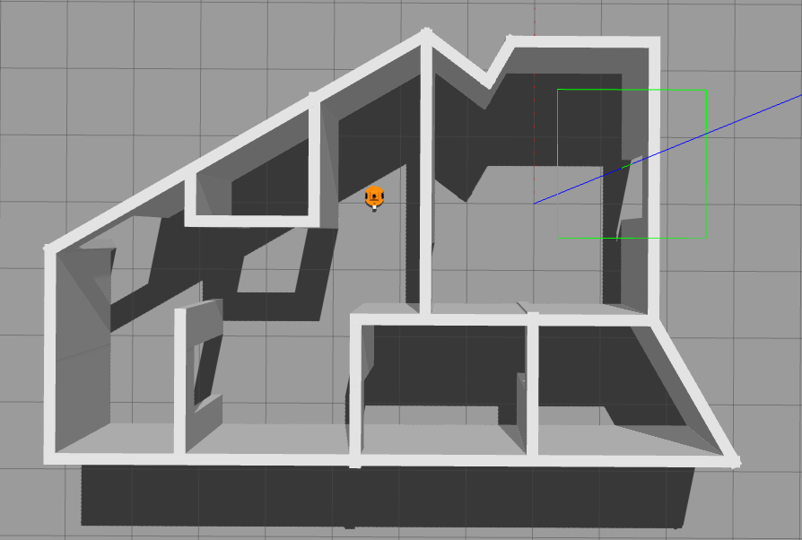
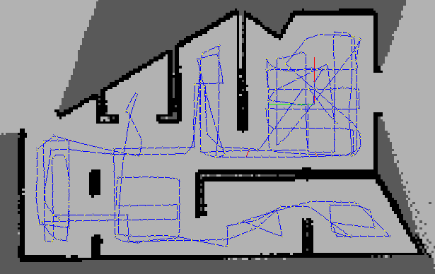

# My Two-Wheel Robot Mapping with RTAB-Map

## Overview

This project implements a two-wheel differential drive robot in a simulated environment using Gazebo, ROS Noetic, and RViz. The robot is equipped with an RGB-D camera and a LIDAR sensor to perform 2D SLAM (Simultaneous Localization and Mapping) using RTAB-Map. The goal is to enable the robot to navigate within a simulated environment and build a map in real-time.

---

## Features

- **Two-Wheel Differential Drive Robot**: The robot is controlled using a differential drive mechanism, simulated in Gazebo.
- **LIDAR and Camera Sensors**: The robot uses LIDAR for scanning the environment and a camera for visual data.
- **AMCL Localization**: The robot localizes itself on a known map using the AMCL particle filter.
- **Accurate Odometry**: The robot has a near-perfect odometry model, allowing for precise movement.
- **Map Alignment**: The robot's position stays aligned with the map in RViz, even after complex movements.
- **Navigation**: The robot uses `move_base` for planning and following paths on the map.
- **RGB-D Camera and LIDAR Sensor**: For depth perception and environment scanning.
- **RTAB-Map SLAM**: Real-time appearance-based mapping and localization.
- **Database Sharing**: The mapping database (rtabmap.db) is available for download.

---

## Installation

To get started with this project, follow the steps below:

### Prerequisites

- **ROS Noetic** (or the ROS version you're using)
- **Gazebo** (compatible with your ROS version)
- **RViz**
- **teleop_twist_keyboard** for manual robot control
- **git**
- **RTAB-Map and rtabmap_ros packages**

### Clone the Repository

```bash
git clone https://github.com/gary-vladimir/RTAB-Mapping.git
```

### Install Dependencies

Make sure to install all necessary ROS dependencies:

```bash
$ sudo apt-get install ros-kinetic-navigation
$ sudo apt-get install ros-kinetic-map-server
$ sudo apt-get install ros-kinetic-move-base
$ sudo apt-get install ros-kinetic-amcl
```

### Build the Workspace

```bash
catkin_make
source devel/setup.bash
```

---

## Usage

### 1. Launch the Simulation Environment

Run the following command to start Gazebo and load the robot in the simulated world:

```bash
roslaunch my_robot world.launch
```

### 2. Start Teleoperation (Optional)

Control the robot manually using the keyboard:

```bash
rosrun teleop_twist_keyboard teleop_twist_keyboard.py
```

Use the keyboard to navigate the robot around the environment.

### 3. Start the Mapping Process

Launch the RTAB-Map mapping node:

```bash
roslaunch my_robot mapping.launch
```

This will start the RTAB-Map node configured for 2D SLAM using the robot's sensors.

To visualize the final map you can run>
```bash
rtabmap-databaseViewer /home/robotgenio/.ros/rtabmap.db

```

replace `/home/robotgenio` for your actual path. 

## Results and Showcase

Here are some images showcasing the robot in the simulation environment and the mapping results:

### Robot in Simulation Environment



*The robot navigating in the simulated environment.*

### Generated Map from RTAB-Map

[Generated Map](https://drive.google.com/file/d/1zCKl-_olL6Dhl8UYQRGWy5mxdtsgOswW/view?usp=sharing)

*The 2D map generated by RTAB-Map during the mapping session.*





---

## License

This project is licensed under the MIT License - see the [LICENSE](LICENSE) file for details.

## Contributing

If you wish to contribute to this project, feel free to open an issue or create a pull request. Contributions for improved localization, new features, or bug fixes are always welcome!

## Contact

For any questions or collaboration requests, please contact me at gary@garybricks.com
```

