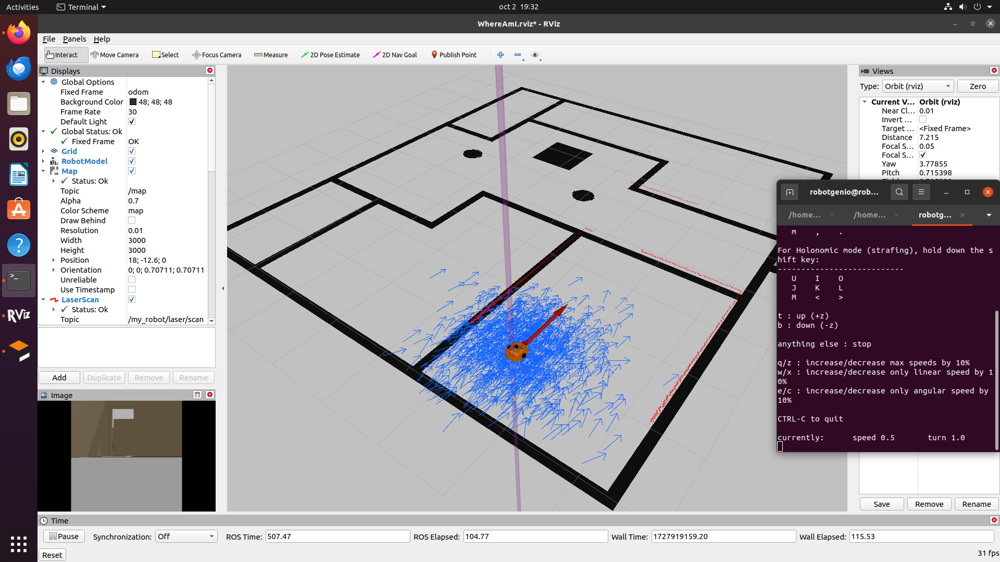
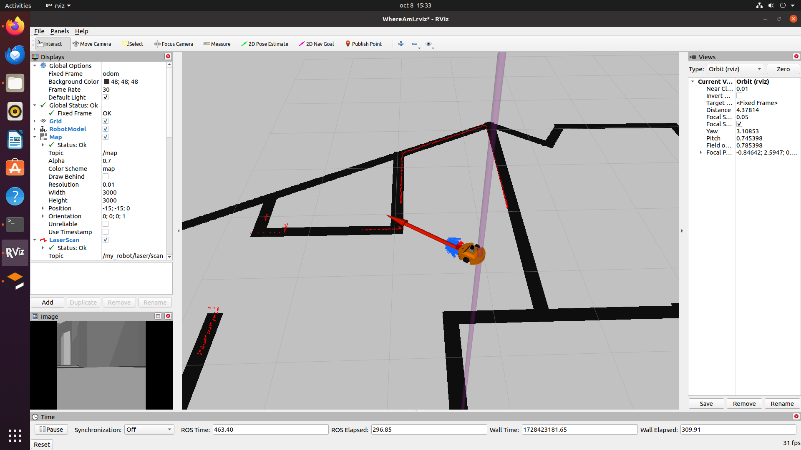
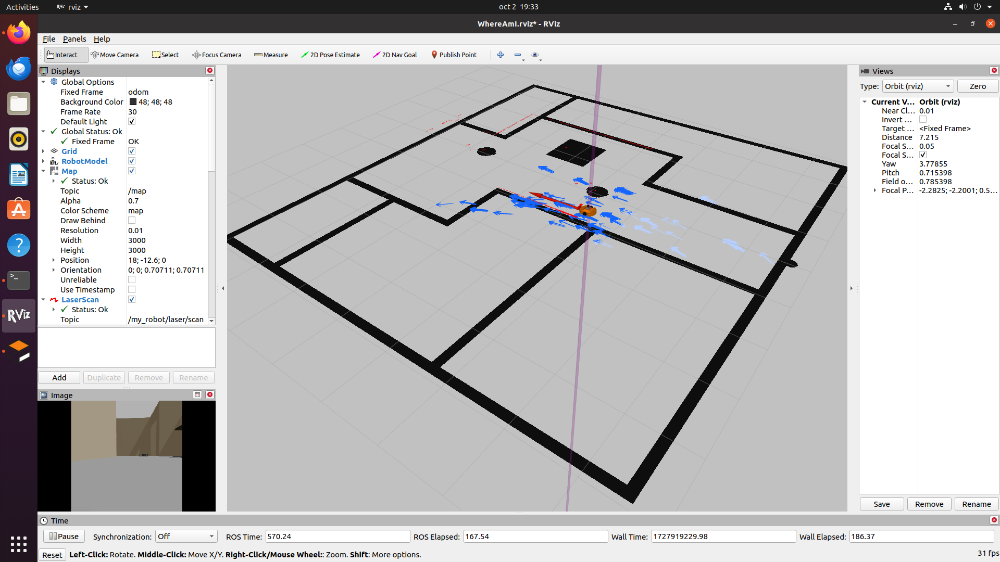
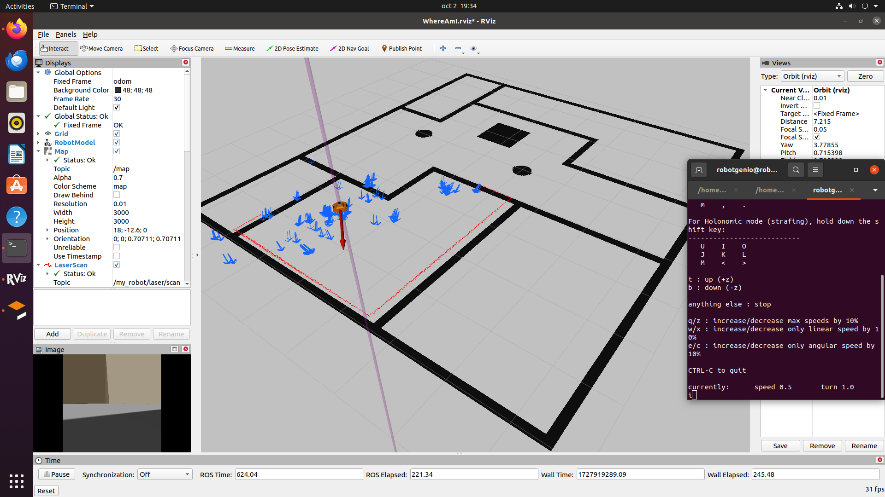
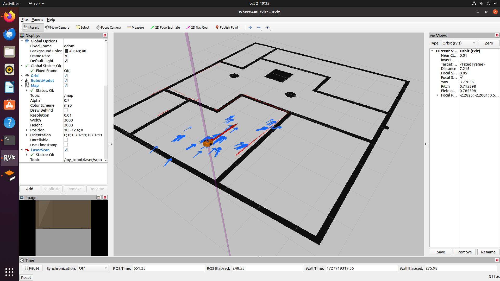

# My Two-Wheel Robot Simulation with AMCL and Navigation

## Overview

This project implements a two-wheel robot in a simulated environment using **Gazebo**, **ROS**, and **RViz**. The goal of the project is to enable localization and navigation for the robot within a known map using the **AMCL** (Adaptive Monte Carlo Localization) node. The robot is equipped with a **LIDAR** sensor for environment scanning and a **camera** for visual perception. The robot can move within a predefined map and localize itself accurately using AMCL, while relying on a precise odometry model and laser scan data.

---

## Features

- **Two-Wheel Differential Drive Robot**: The robot is controlled using a differential drive mechanism, simulated in Gazebo.
- **LIDAR and Camera Sensors**: The robot uses LIDAR for scanning the environment and a camera for visual data.
- **AMCL Localization**: The robot localizes itself on a known map using the AMCL particle filter.
- **Accurate Odometry**: The robot has a near-perfect odometry model, allowing for precise movement.
- **Map Alignment**: The robot's position stays aligned with the map in RViz, even after complex movements.
- **Navigation**: The robot uses `move_base` for planning and following paths on the map.

---

## Installation

To get started with this project, follow the steps below:

### Prerequisites

- **ROS Noetic** (or the ROS version you're using)
- **Gazebo** (compatible with your ROS version)
- **RViz**
- **teleop_twist_keyboard** for manual robot control
- **git**

### Clone the Repository

```bash
git clone https://github.com/gary-vladimir/Where-Am-I-AMCL.git
cd Where-Am-I-AMCL
```

### Install Dependencies

Make sure to install all necessary ROS dependencies:

```bash
$ sudo apt-get install ros-kinetic-navigation
$ sudo apt-get install ros-kinetic-map-server
$ sudo apt-get install ros-kinetic-move-base
$ sudo apt-get install ros-kinetic-amcl
```

### Build the Workspace

```bash
catkin_make
source devel/setup.bash
```

---

## Usage

### 1. Launch the Gazebo World

Run the following command to start Gazebo and load the environment where the robot will operate:

```bash
roslaunch my_robot world.launch
```

### 2. Launch AMCL and Navigation

Once Gazebo is running, launch the AMCL and move_base nodes:

```bash
roslaunch my_robot amcl.launch
```

### 3. Control the Robot

You can manually control the robot using the teleop keyboard by running:

```bash
rosrun teleop_twist_keyboard teleop_twist_keyboard.py
```

In RViz, you'll be able to visualize after opening the provided WhereAmI.rviz:

- The **robot's position** on the map.
- The **LIDAR scan** of the environment.
- The **AMCL particle cloud** as the robot moves.

---

## Tuning and Customization

If you wish to modify parameters for localization or navigation, you can edit the `amcl.launch` file, adjusting parameters such as:

- **`odom_alpha1`, `odom_alpha2`**: Odometry noise parameters.
- **`laser_z_hit`, `laser_z_rand`**: Laser model parameters.
- **`min_particles`, `max_particles`**: Number of particles used by AMCL.
- **`resample_interval`, `kld_err`**: AMCL resampling and particle spread control.


---

## Results and Showcase

Here’s how the robot performs in the simulation environment:










---

## License

This project is licensed under the MIT License - see the [LICENSE](LICENSE) file for details.

## Contributing

If you wish to contribute to this project, feel free to open an issue or create a pull request. Contributions for improved localization, new features, or bug fixes are always welcome!

## Contact

For any questions or collaboration requests, please contact me at gary@garybricks.com
```

